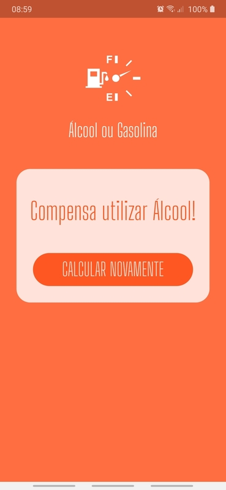

# App - Álcool ou Gasolina

## Aplicativo para saber se compensa colocar álcool ou gasolina no tanque do carro.

#### Projeto do curso 7192 - Flutter Apps:Álcool ou Gasolina do [balta.io](balta.io).

**Font**: [Big Shoulders Display](https://fonts.google.com/specimen/Big+Shoulders+Display?query=Big)

**Masked Text** [Flutter Masked Text](https://pub.dev/packages/flutter_masked_text)

## Screenshot

  

  
